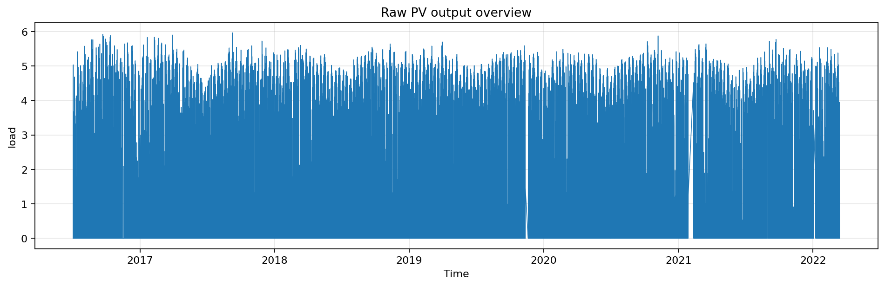

# 课题背景与数据集总览

## 1. 研究背景

光伏发电具有明显的随机性、波动性与间歇性，尤其在云量变化、辐照强度突变及温湿度波动条件下，输出功率序列会表现出较强的非线性与时变性。对未来 24 小时光伏功率进行稳定、准确的日前预测，不仅关系到配电侧调度与负荷平衡，也直接影响新能源消纳、备用容量安排与日前市场申报精度。因此，构建兼顾预测精度、训练效率与工程可解释性的预测模型，具有较强的实际意义。

本实验以历史气象、辐照与功率观测数据为基础，构建多变量多步预测任务：使用过去 `memory_length` 个 15 分钟采样点的信息，预测未来 24 小时共 96 个功率点。评价指标采用标准化均方根误差 `nRMSE`、标准化平均绝对误差 `nMAE` 以及决定系数 `R2`，从误差幅度与拟合优度两个层面综合衡量模型性能。

## 2. 数据来源与任务定义

实验使用的原始 CSV 文件包含风速、温度、相对湿度、水平辐照、倾斜面辐照以及历史光伏输出功率等变量。任务书给出的数据背景为澳大利亚 Alice Springs 光伏示范设施数据，报告以实际提供的 CSV 文件为准。实际文件时间范围覆盖 `2016-07-03 00:00:00` 至 `2022-03-13 22:15:00`，时长超过任务书中示意性描述的时间范围，说明最终实验应以真实时间戳内容而非题面摘要为准。

## 3. 数据集概览

表 1 给出了数据规模与预处理前后的总体统计。

| 指标 | 数值 |
|---|---:|
| 原始记录数 | 590,753 |
| 15 分钟重采样后记录数 | 199,674 |
| 重采样前缺失值总数 | 35,542 |
| 重采样后缺失值总数 | 0 |
| 负功率样本数（处理前） | 762 |
| 负功率样本数（处理后） | 0 |
| 起始时间 | 2016-07-03 00:00:00 |
| 结束时间 | 2022-03-13 22:15:00 |

原始字段包括时间戳与 13 个数值变量。字段完整性统计显示，CSV 文件在列层面并不存在空字段；真正的“缺失”主要表现为时间轴上的采样间断，即重采样到统一 15 分钟网格后形成的大量缺口。因此，本实验的预处理重点并不是逐列补全，而是恢复时间连续性。

表 2 列出了主要观测变量。

| 类别 | 变量 |
|---|---|
| 气象变量 | `Wind_Speed`，`Weather_Temperature_Celsius`，`Weather_Relative_Humidity`，`Wind_Direction`，`Weather_Daily_Rainfall` |
| 辐照变量 | `Global_Horizontal_Radiation`，`Diffuse_Horizontal_Radiation`，`Radiation_Global_Tilted`，`Radiation_Diffuse_Tilted` |
| 电气变量 | `Active_Energy_Delivered_Received`，`Current_Phase_Average`，`Performance_Ratio` |
| 目标变量 | `load` |

从统计量看，辐照、功率和电流类变量呈现明显的昼夜分布特征：中位数接近于零，而上四分位数与最大值较高，说明夜间大量样本接近零功率、白天则出现明显峰值；温度与湿度则相对平稳，但仍受季节变化影响。

图 1 展示了原始功率序列的整体走势。可以观察到长期序列中既存在强烈的日周期性，也伴随季节性波动与局部异常波动。该特征决定了模型必须同时具备短期局部模式提取能力与中长期趋势刻画能力。

## 4. 数据集的建模含义

从预测建模角度看，该数据集具有以下特点：

1. 目标变量具有明显的周期性与稀疏性。夜间功率长期为零或接近零，而白天功率峰值高度依赖辐照条件。
2. 辐照特征与历史功率具有直接物理联系，是模型性能的核心决定因素。
3. 多变量之间存在较强相关性，尤其是水平辐照、倾斜面辐照、当前功率与短期滞后功率之间。
4. 时间重采样后产生规则时间网格，为构造序列窗口、滞后项和滚动统计量提供了统一基础。

因此，后续实验采用“时间连续化处理 + 时序特征构造 + 多模型比较”的路线，在保证物理合理性的同时尽可能提高日前多步预测精度。
