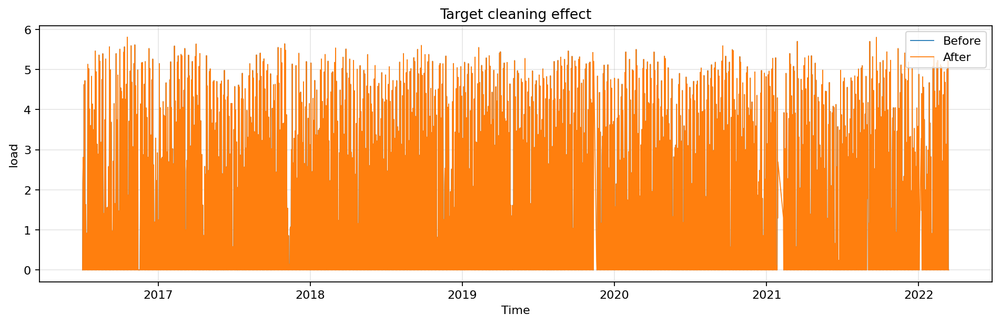
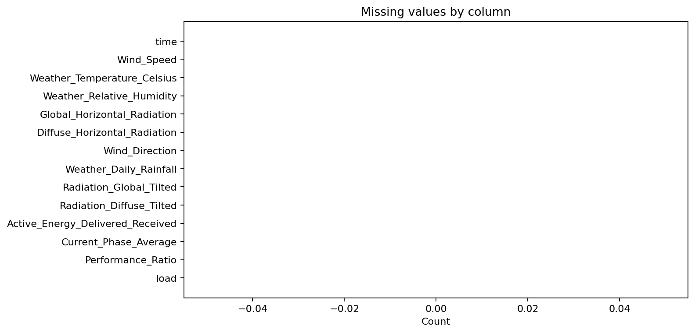

# 数据预处理过程与发现

## 1. 预处理目标

原始光伏数据虽然在字段层面完整，但并不能直接用于多步时间序列建模。首先，任务要求预测分辨率为 15 分钟，而原始数据采样粒度更细；其次，时间轴存在间断，直接构造窗口会造成样本不连续；再次，少量负功率与异常值不符合物理意义，会干扰误差计算与模型训练。因此，本实验围绕“统一时间粒度、补全时间连续性、校正异常功率、归一化输入输出”四个目标开展预处理。

## 2. 时间重采样与缺失恢复

重采样前，原始 CSV 的列级缺失值为 0，但将数据映射到统一的 15 分钟时间网格后，每个数值字段均出现了完全一致的 2,734 个缺失点。这说明缺失并非单变量传感器故障，而是采样时刻整体缺测或时间戳不规则所致。

表 1 给出重采样后各变量缺失点数。由于所有字段缺失数量一致，可以判断缺失主要由时间轴间断引起。

| 变量 | 重采样后缺失值个数 |
|---|---:|
| `Wind_Speed` | 2734 |
| `Weather_Temperature_Celsius` | 2734 |
| `Weather_Relative_Humidity` | 2734 |
| `Global_Horizontal_Radiation` | 2734 |
| `Diffuse_Horizontal_Radiation` | 2734 |
| `Wind_Direction` | 2734 |
| `Weather_Daily_Rainfall` | 2734 |
| `Radiation_Global_Tilted` | 2734 |
| `Radiation_Diffuse_Tilted` | 2734 |
| `Active_Energy_Delivered_Received` | 2734 |
| `Current_Phase_Average` | 2734 |
| `Performance_Ratio` | 2734 |
| `load` | 2734 |

在处理策略上，实验先对原始时间戳进行解析、排序和去重，随后按 15 分钟粒度求均值。对重采样后出现的空缺，采用“时间插值 + 前向填充 + 后向填充”的组合方式处理。这一策略适合光伏功率与气象变量的平滑时序特性，可在不引入大幅突变的情况下恢复连续样本。

图 2 展示了重采样前后的缺失情况。可以看到，原始文件的列级缺失并不明显，而统一时间网格后的时间缺口才是主要问题来源。

## 3. 异常值与负功率修正

光伏功率在物理上不应出现持续性的负值，但原始数据中存在 762 个负功率点，且最小值约为 `-0.006867`。这些值数量不大、幅度较小，更可能来源于测量噪声或传感误差，而非真实的逆向出力。因此，本实验将目标功率的负值统一截断为 0，以保证预测对象符合工程物理约束。

对于其他数值变量，则采用 IQR（四分位距）方法进行异常值截断。与直接删除异常样本相比，截断策略可以在不破坏长时序连续性的前提下抑制极端值影响，更适合滑动窗口建模场景。

图 3 给出了目标功率在清洗前后的对比。可以看出，清洗后序列整体趋势保持一致，但局部异常尖峰与非物理负值被明显削弱，序列形态更加平滑稳定。

图 4 显示经过缺失值填补和异常值处理后，建模所需的 15 分钟连续时间网格已不再存在空缺，满足后续构造固定长度序列样本的要求。

## 4. 归一化策略

任务书要求采用标准化误差指标。为保证不同变量量纲可比，并使 `nRMSE`、`nMAE` 基于 `[0,1]` 范围内的目标值计算，本实验对输入特征与目标变量分别进行归一化：

1. 输入特征采用 `Min-Max` 归一化；
2. 目标功率单独归一化到 `[0,1]`；
3. 后续误差计算基于标准化目标完成，再报告为百分数形式。

这一设计有两个优点。其一，不同量纲的气象、辐照与电气特征可以在同一模型中稳定训练；其二，误差指标不再受原始装机容量或功率量级影响，更便于模型间横向比较。

## 5. 预处理阶段的主要发现

预处理阶段得到以下几点对后续建模具有指导意义的结论：

1. 数据文件的主要问题不是“字段缺失”，而是“时间轴不连续”。这解释了为什么简单按列统计缺失无法发现真正风险。
2. 负功率样本数量不大、幅度极小，说明目标变量总体质量较好，但需要做物理约束修正。
3. 连续时间插值与异常值截断后，功率序列的周期结构得以保留，为构造高质量时序特征提供了前提。
4. 重采样后的统一 15 分钟粒度与任务书要求完全一致，使模型输出天然对应未来 24 小时 96 点序列。

综上，预处理阶段并非简单的数据清洗，而是将“原始监测记录”转化为“可稳定用于多步预测的规则时间序列”，这也是后续模型性能能够稳定达到 `R2>0.88` 的基础。
