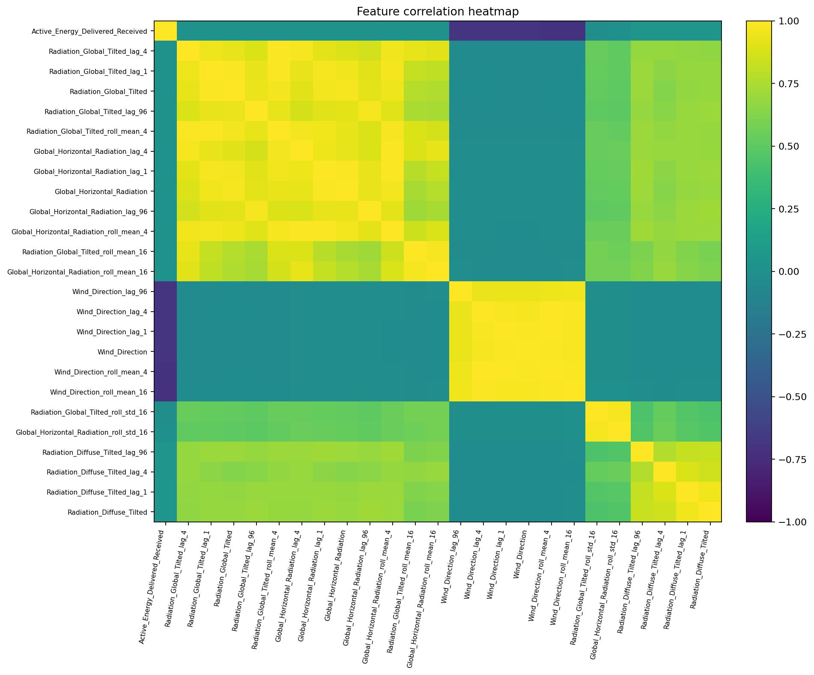
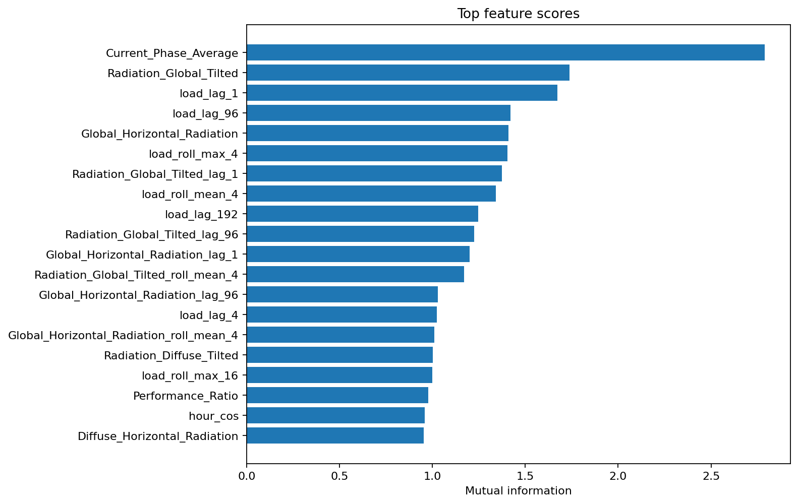
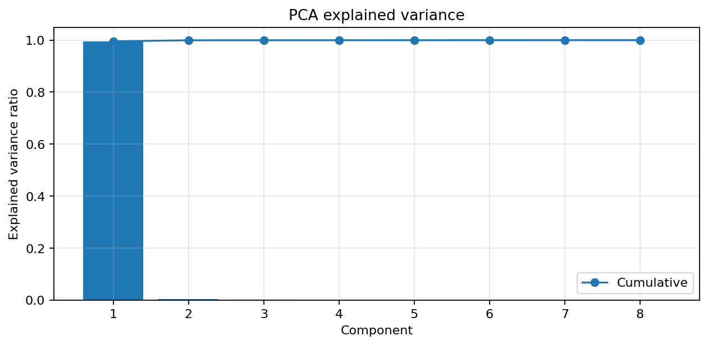
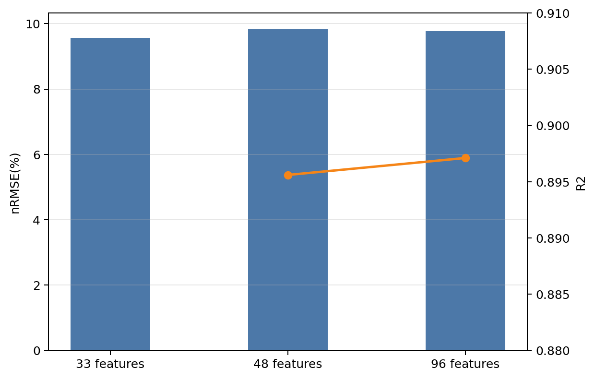

# 特征工程处理与性能影响分析

## 1. 特征工程设计思路

光伏功率具有显著的日周期性和强烈的短时依赖关系，仅依赖原始气象字段难以充分表达这些规律。因此，本实验采用“原始外生变量 + 时间周期特征 + 历史滞后特征 + 滚动统计特征”的组合方案，以增强模型对昼夜转换、天气扰动与短期惯性的建模能力。

特征工程主要包括以下四类：

1. **时间周期特征**：`hour_sin/cos`、`dayofyear_sin/cos`、`dayofweek_sin/cos`、`month`，用于表达日周期、季节周期与周内周期；
2. **目标滞后特征**：`load_lag_1`、`load_lag_4`、`load_lag_8`、`load_lag_96`、`load_lag_192`，用于表征短时惯性与日周期记忆；
3. **目标滚动统计特征**：最近 4、16、96 个点的均值、标准差与最大值，用于表征局部波动强度与短期趋势；
4. **气象与辐照滞后特征**：对风速、温度、湿度、水平辐照、倾斜面辐照等变量构造 `lag_1`、`lag_4`、`lag_96` 以及短窗滚动统计量，用于将外生变量的时间演化过程显式输入模型。

## 2. 相关性与互信息分析

图 1 给出了主要数值变量的相关性热力图。可以观察到，当前功率与辐照类变量之间存在显著正相关，而与湿度等变量则存在较复杂的非线性关系。辐照类特征内部相关性也较高，说明这些变量既包含冗余信息，也共同构成了光伏功率预测的核心驱动因素。

图 2 的互信息结果进一步表明，影响最大的并不只是原始辐照值本身，还包括短期滞后功率、短窗滚动均值以及辐照的滞后统计量。这说明功率预测既依赖即时外生条件，也依赖近邻时刻的局部动力学结构。

## 3. 入选特征的结构特征

在最终表现较好的 `XGBoost` 配置中，保留的 48 个特征具有较明确的结构性。排名靠前的特征主要包括：

| 排名 | 特征 |
|---|---|
| 1 | `Current_Phase_Average` |
| 2 | `Radiation_Global_Tilted` |
| 3 | `load_lag_1` |
| 4 | `Radiation_Global_Tilted_lag_1` |
| 5 | `Global_Horizontal_Radiation` |
| 6 | `load_roll_mean_4` |
| 7 | `load_roll_max_4` |
| 8 | `Global_Horizontal_Radiation_lag_1` |
| 9 | `Radiation_Global_Tilted_roll_mean_4` |
| 10 | `load_lag_96` |
| 11 | `Global_Horizontal_Radiation_roll_mean_4` |
| 12 | `Radiation_Global_Tilted_lag_96` |
| 13 | `load_lag_192` |
| 14 | `load_lag_4` |
| 15 | `Global_Horizontal_Radiation_lag_96` |

这些结果说明：

1. **辐照变量是第一层核心驱动**。尤其是倾斜面辐照和水平辐照，与组件受光状态具有直接物理对应关系。
2. **短时历史功率是第二层核心驱动**。`load_lag_1`、`load_roll_mean_4`、`load_roll_max_4` 的重要性很高，说明功率序列具有明显惯性。
3. **24 小时与 48 小时记忆具有补充价值**。`load_lag_96` 与 `load_lag_192` 同时入选，说明日前预测不仅依赖当前白天局部模式，也受前一日或前两日同时间段的出力状态影响。
4. **温湿度类变量是辅助修正项**。它们通常不会主导功率峰值，但会对辐照-功率映射关系产生补偿作用。

图 3 的 PCA 解释方差曲线表明，少数主成分即可吸收相当比例的信息量。这也是后续对深度模型尝试特征降维的理论依据：在深度模型表现未明显优于树模型时，先压缩输入维度能够有效降低训练难度。

## 4. 不同特征数对随机森林性能的影响

为分析特征数量对模型性能的影响，本实验以随机森林为例，对 33、48 和 96 个特征三种设置进行比较。结果见表 1。

| 特征数 | nRMSE(%) | nMAE(%) | R2 |
|---:|---:|---:|---:|
| 33 | 9.5590 | 4.4162 | 0.9014 |
| 48 | 9.8350 | 4.5675 | 0.8956 |
| 96 | 9.7636 | 4.4887 | 0.8971 |

图 4 表明，特征数增加并不一定带来性能持续提升。对随机森林而言，33 个特征的表现反而优于 48 个和 96 个特征。这一现象说明：

1. 树模型对高维冗余特征较敏感，过多相关变量会稀释有效分裂；
2. 当重要信息已由核心辐照与功率滞后特征覆盖时，继续加入大量弱相关统计特征可能只会增加噪声；
3. 特征工程的关键并非“越多越好”，而是通过合理筛选保留最具物理意义与统计贡献的特征。

## 5. 特征工程阶段的主要结论

特征工程阶段得到以下结论：

1. 光伏日前预测中，**辐照变量 + 历史功率滞后** 的组合最关键；
2. 短窗滚动统计量能够显著增强模型对局部变化趋势的感知；
3. 气象滞后特征对深度模型和树模型均有增益，但在树模型中需要结合筛选使用；
4. 对树模型而言，适度降维或特征筛选有利于提升泛化能力；
5. 对深度模型而言，PCA 降维可作为降低训练复杂度的有效先验步骤。

因此，后续模型比较与调优均以“保留关键物理驱动、适度压缩冗余特征”为基本原则展开。
