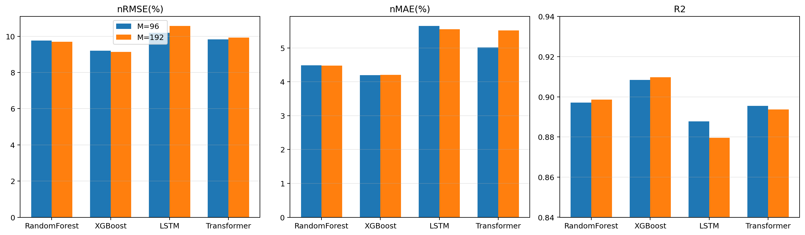
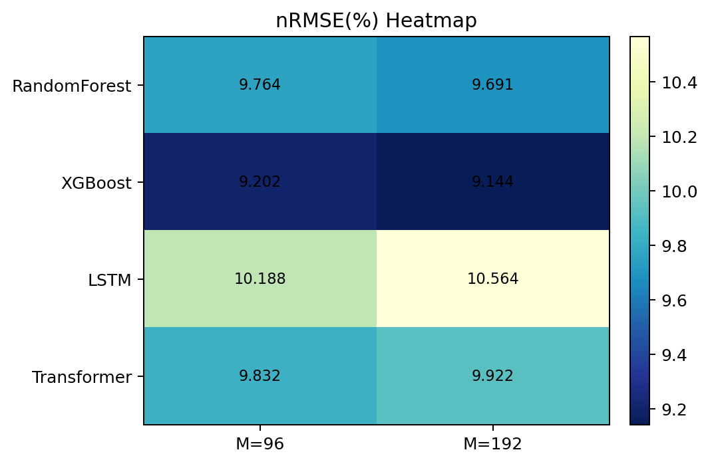
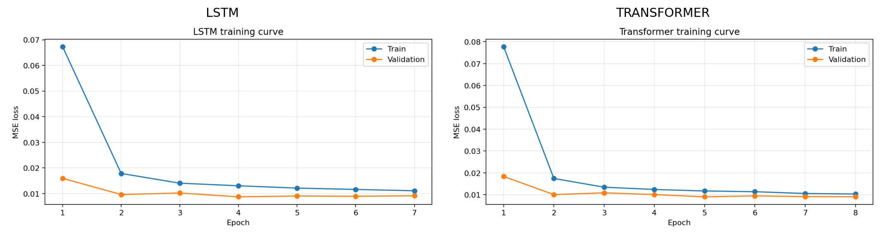
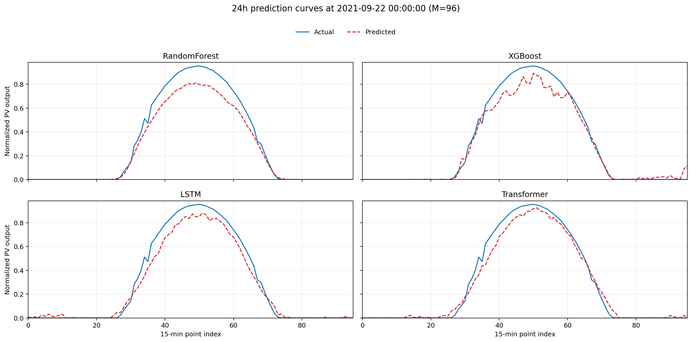
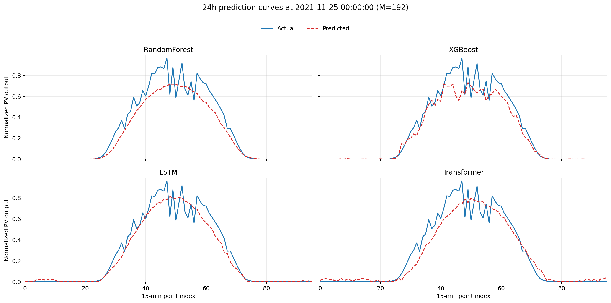
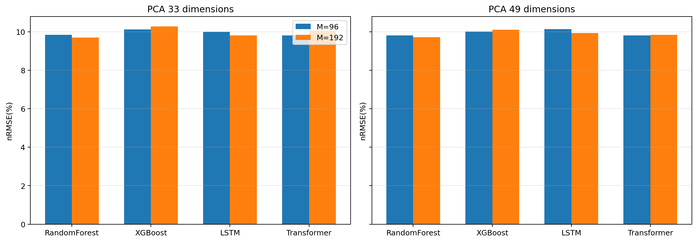
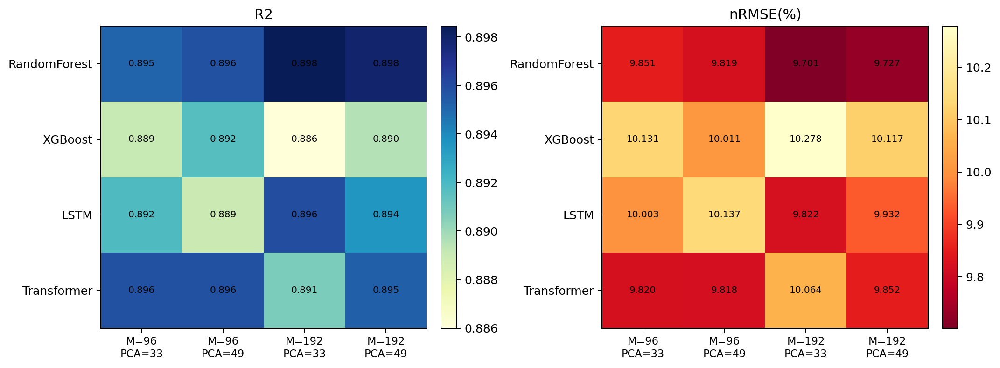
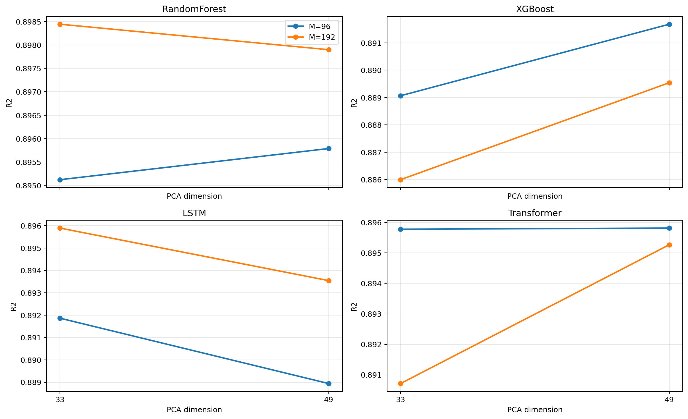
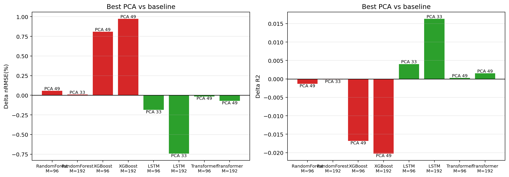

# 四类模型在 96 与 192 条件下的性能比较与现象分析

## 1. 实验设置

本节比较四类模型在 `memory_length=96` 和 `memory_length=192` 条件下的性能：

- Random Forest
- XGBoost
- LSTM
- Transformer

其中，`memory_length=96` 表示使用过去 24 小时信息预测未来 24 小时；`memory_length=192` 表示使用过去 48 小时信息预测未来 24 小时。所有结果均采用正式实验记录或在相同设置下复现实验所得，快速测试与异常记录不纳入比较。

## 2. 性能总览

表 1 给出了四类模型在两种记忆长度下的核心指标。

| 模型 | Memory length | nRMSE(%) | nMAE(%) | R2 |
|---|---:|---:|---:|---:|
| RandomForest | 96 | 9.7636 | 4.4887 | 0.8971 |
| RandomForest | 192 | 9.6912 | 4.4795 | 0.8986 |
| XGBoost | 96 | 9.2024 | 4.2004 | 0.9085 |
| XGBoost | 192 | 9.1436 | 4.2046 | 0.9098 |
| LSTM | 96 | 10.1882 | 5.6451 | 0.8878 |
| LSTM | 192 | 10.5638 | 5.5499 | 0.8796 |
| Transformer | 96 | 9.8323 | 5.0126 | 0.8955 |
| Transformer | 192 | 9.9218 | 5.5212 | 0.8938 |

从总体结果可以得到三点明确结论：

1. **XGBoost 在两种记忆长度下均取得最优结果**，其中 `M=192` 的 `R2=0.9098` 为未调优四模型比较中的最佳表现；
2. **RandomForest 表现稳定但略逊于 XGBoost**，说明树模型整体适合该任务，但梯度提升树更擅长利用复杂非线性关系；
3. **深度模型尚未超过树模型**。Transformer 的误差略优于 LSTM，但两者都未突破 XGBoost，表明在当前样本规模与特征组织方式下，深度模型的优势尚未充分释放。

## 3. 记忆长度的影响

从 96 到 192 的变化可以观察到不同模型对历史窗口长度的敏感性存在明显差异：

- RandomForest：`nRMSE` 从 9.7636 降至 9.6912，说明增加到 48 小时历史信息后有小幅收益；
- XGBoost：`nRMSE` 从 9.2024 降至 9.1436，`R2` 从 0.9085 提升至 0.9098，说明更长记忆有助于增强日前同周期模式识别；
- LSTM：`nRMSE` 反而从 10.1882 上升至 10.5638，说明更长输入序列增加了优化难度；
- Transformer：`nRMSE` 从 9.8323 上升至 9.9218，说明在当前模型规模下，长序列输入并未转化为稳定收益。

这表明，**更长的记忆长度并不总是带来更高精度**。对于树模型，额外历史信息通常能够作为有效特征被显式利用；而对深度模型，长序列会带来更高的优化复杂度和更大的参数搜索空间，若模型容量和训练策略没有同步加强，性能反而可能下降。

## 4. 训练过程分析

图 3 显示，LSTM 与 Transformer 的训练损失和验证损失都能较快下降，并在较少 epoch 内趋于平稳。这说明深度模型并非完全无法收敛，而是其收敛到的解在测试集上的泛化能力仍未优于树模型。进一步结合误差水平可以推断，当前限制深度模型的主要瓶颈并不在于“无法训练”，而在于以下几点：

1. 数据规模相对有限，尚不足以充分支撑高容量时序模型的优势；
2. 输入特征虽丰富，但对深度模型而言仍存在一定冗余；
3. 目标为 96 步直接多输出预测，学习难度显著高于单步回归；
4. 目前使用的是基础版 LSTM/Transformer，而非专门面向长时序预测的更强骨干。

## 5. 未来 24 小时预测曲线

### 5.1 Memory length = 96

图中四条曲线均取自**同一测试日 `2021-09-22 00:00:00`** 开始的未来 24 小时窗口，因此不同模型的形态差异可以直接进行横向比较。在 `M=96` 条件下，XGBoost 与 RandomForest 能较好捕捉白天功率主峰的位置和整体轮廓；Transformer 的峰值跟踪能力接近树模型，但在低谷与肩部区间存在更明显偏差；LSTM 则更容易在快速爬升段和峰值附近产生振幅低估。

### 5.2 Memory length = 192

图中四条曲线均取自**同一测试日 `2021-11-25 00:00:00`** 开始的未来 24 小时窗口。在 `M=192` 条件下，树模型的曲线形态进一步稳定，尤其是 XGBoost 对峰值位置与白天整体出力包络的跟踪最为接近实际值；LSTM 和 Transformer 虽然能够把握日内大体结构，但在阴影遮挡或辐照快速波动带来的局部扰动上仍不够灵敏。

## 6. 结果现象的原因分析

### 6.1 为什么 XGBoost 最优

XGBoost 在本实验中最优，主要原因在于：

1. 经过特征工程后，输入已经显式编码了大量短期时序信息与周期信息；
2. 梯度提升树对中等规模结构化特征表现稳定，能够高效利用滞后项和滚动统计量；
3. 光伏功率与辐照、温湿度之间存在复杂但局部可分的非线性关系，树模型对此具有天然优势；
4. 在样本规模有限时，XGBoost 的偏差-方差权衡通常优于未经专门设计的深度模型。

### 6.2 为什么 RandomForest 稳定但略弱

随机森林通过多树平均降低了过拟合风险，因此性能稳定、误差分布相对平滑。但它对复杂残差结构的逐步逼近能力弱于梯度提升树，因此在精度上通常略逊于 XGBoost。

### 6.3 为什么 Transformer 优于 LSTM 但仍未超越树模型

Transformer 通过自注意力机制能够更灵活地捕捉远距离依赖，因此在 `nRMSE` 上优于 LSTM；但当前模型结构仍较基础，尚未使用 PatchTST、iTransformer 等更适合长时序预测的架构，也未引入更激进的训练策略和未来气象先验，因此优势尚不足以反超 XGBoost。

### 6.4 为什么深度模型在 192 条件下未获益

理论上，48 小时历史可以提供更丰富的周期信息；但在当前设置下，长输入同时带来了更高维度、更长梯度路径和更复杂的优化问题。对于容量有限且训练轮数受控的基础深度模型，这一额外信息反而可能被优化难度抵消。

## 7. PCA 补充实验

为进一步分析“输入特征表示方式”对不同模型的影响，本节在正式基线之外，又补充了 `4` 种模型、`2` 个历史窗口长度（`96/192`）以及 `2` 种 PCA 维度（`33/49`）下的共 `16` 组实验。该组实验统一采用：

- `horizon=96`
- `max_windows=5000`
- 训练/验证/测试按时间顺序划分
- 深度模型继续使用早停策略
- 所有模型均在标准化后执行 PCA，再进入各自的预测器

### 7.1 PCA=33 的实验结果

| 模型 | Memory length | PCA维度 | nRMSE(%) | nMAE(%) | R2 |
|---|---:|---:|---:|---:|---:|
| RandomForest | 96 | 33 | 9.8508 | 4.8282 | 0.8951 |
| RandomForest | 192 | 33 | 9.7013 | 4.8668 | 0.8984 |
| XGBoost | 96 | 33 | 10.1314 | 5.2817 | 0.8891 |
| XGBoost | 192 | 33 | 10.2785 | 5.4114 | 0.8860 |
| LSTM | 96 | 33 | 10.0028 | 5.3878 | 0.8919 |
| LSTM | 192 | 33 | 9.8222 | 5.4268 | 0.8959 |
| Transformer | 96 | 33 | 9.8200 | 5.2484 | 0.8958 |
| Transformer | 192 | 33 | 10.0637 | 5.6657 | 0.8907 |

### 7.2 PCA=49 的实验结果

| 模型 | Memory length | PCA维度 | nRMSE(%) | nMAE(%) | R2 |
|---|---:|---:|---:|---:|---:|
| RandomForest | 96 | 49 | 9.8195 | 4.7191 | 0.8958 |
| RandomForest | 192 | 49 | 9.7272 | 4.7834 | 0.8979 |
| XGBoost | 96 | 49 | 10.0113 | 5.0760 | 0.8917 |
| XGBoost | 192 | 49 | 10.1174 | 5.2225 | 0.8895 |
| LSTM | 96 | 49 | 10.1372 | 5.7203 | 0.8889 |
| LSTM | 192 | 49 | 9.9325 | 5.7041 | 0.8935 |
| Transformer | 96 | 49 | 9.8183 | 5.1961 | 0.8958 |
| Transformer | 192 | 49 | 9.8516 | 5.3676 | 0.8953 |

### 7.3 PCA 实验的主要现象

从 16 组补充实验可以观察到以下规律：

1. **PCA 并未改变整体最优模型的归属。** 在全部 PCA 实验中，最好的结果是 `RandomForest, M=192, PCA=33`，其 `nRMSE=9.7013%`、`R2=0.8984`；但这一结果仍低于正式基线中的 `XGBoost, M=192`（`nRMSE=9.1436%`, `R2=0.9098`）。
2. **XGBoost 对 PCA 最敏感，且性能下降最明显。** `M=96` 和 `M=192` 条件下，即使选择更优的 `PCA=49`，`nRMSE` 仍分别上升到 `10.0113%` 和 `10.1174%`。
3. **LSTM 从 PCA 中获得了最明显收益。** `M=192, PCA=33` 的 `nRMSE=9.8222%`，相较未做 PCA 的 `10.5638%` 有显著改善，`R2` 也从 `0.8796` 提升到 `0.8959`。
4. **Transformer 也从 PCA 中获得了小幅稳定收益。** 其更适合 `PCA=49` 而非 `PCA=33`，说明过强压缩会损失部分对注意力机制有用的变量差异。
5. **RandomForest 基本保持稳定。** 无论 `33` 维还是 `49` 维，性能波动都很小，说明袋装树模型对冗余特征并不过分敏感，但也很难从线性主成分压缩中获得额外收益。

### 7.4 与正式基线的对比

图 7 给出了“各模型在每个记忆长度下，最佳 PCA 结果相对正式基线的变化”。可见：

- `LSTM` 的两组实验均明显受益于 PCA，其中 `M=192` 的增益最大；
- `Transformer` 的增益幅度较小，但方向稳定为正；
- `RandomForest` 的差异接近于零，可视为“基本持平”；
- `XGBoost` 的差值全部为负，说明对该类提升树模型而言，PCA 破坏了原始滞后特征与气象特征的可分裂结构。

从机理上看，这一现象具有合理性。PCA 是线性旋转与投影，它更适合为深度网络提供**低冗余、低噪声、较平滑**的输入表示，从而降低优化难度；而树模型，尤其是 XGBoost，更依赖原始特征轴上的阈值分裂来刻画“某个辐照量达到一定水平后功率快速上升”这类非线性关系。经过 PCA 后，不同物理量被混合为主成分，变量的局部可解释性与分裂边界的清晰度都会下降，因此提升树性能反而受损。

另一方面，`LSTM` 对 `PCA=33` 的偏好强于 `PCA=49`，说明其主要瓶颈确实来自高维输入下的优化压力和噪声传播；较强的压缩可以在保留主要时序模式的同时，减少不必要的扰动。`Transformer` 则更偏好 `PCA=49`，说明自注意力结构仍希望保留更丰富的通道差异，只是在完全使用 `96` 维原始特征时，冗余度偏高，导致泛化能力受到一定影响。

## 8. 本节结论

综合正式基线实验与 PCA 补充实验，可以得到更完整的结论：

1. **正式基线下的最优模型仍为 XGBoost，最佳设置为 `M=192`。**
2. **PCA 不是普适增益手段，而是显著依赖模型类型。**
3. **若目标是提升深度模型表现，PCA 是有效方向，其中 `LSTM` 更适合较强压缩（33 维），`Transformer` 更适合较温和压缩（49 维）。**
4. **若目标是取得全任务最高精度，则当前仍应以不做 PCA 的 XGBoost 作为主力模型。**

因此，本节的结论不仅支持第五章继续围绕 XGBoost 展开定向调优，也说明了深度模型后续优化应优先聚焦于“更适合时间序列的模型骨干 + 合理的输入压缩策略”，而不是单纯增加历史窗口长度或盲目扩大模型规模。
