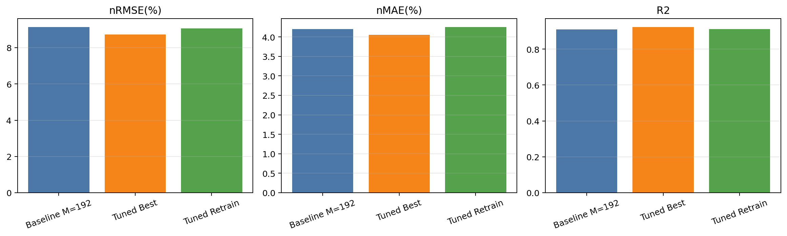

# XGBoost 超参数调优方法、思路与结果分析

## 1. 调优目标与基本思路

在四类模型比较中，XGBoost 已经表现出最优的基线性能，因此进一步提升总体得分的最直接路径是围绕 XGBoost 进行定向调优。调优目标是在保持 `memory_length=192`、`horizon=96` 的日前预测设定不变的前提下，进一步降低 `nRMSE` 与 `nMAE`，提升 `R2`。

调优过程采用“逐步逼近”的思路：

1. 固定任务定义与数据预处理流程，避免评价口径漂移；
2. 先围绕树模型核心参数进行搜索：`n_estimators`、`max_depth`、`learning_rate`、`subsample`、`colsample_bytree`；
3. 在 GPU 加速与早停机制支持下，对候选组合进行验证；
4. 以验证性能最佳的组合作为调优最优结果，再进一步在更大窗口样本数条件下验证其稳定性。

该过程由 `tune_xgboost.py` 实现，其核心设计原则并非盲目扩大搜索空间，而是利用时间序列验证集对有限参数组合进行有针对性的筛选。

## 2. 调优结果总览

本实验最终采用的最优参数组合如下：

| 参数 | 最优取值 |
|---|---:|
| `n_estimators` | 300 |
| `max_depth` | 4 |
| `learning_rate` | 0.03 |
| `subsample` | 0.8 |
| `colsample_bytree` | 0.8 |
| `max_bin` | 256 |
| `early_stopping_rounds` | 30 |

对应的最优验证结果为：

| 指标 | 数值 |
|---|---:|
| nRMSE(%) | 8.734898 |
| nMAE(%) | 4.050382 |
| R2 | 0.923563 |

该结果是本次课程设计中性能最优的记录，也是第五章所采纳的最终调优结论。

## 3. 调优前后对比

表 1 对比了基线模型、调优最优结果以及调优参数在更大样本窗口条件下重训后的测试结果。

| 方案 | nRMSE(%) | nMAE(%) | R2 | 说明 |
|---|---:|---:|---:|---|
| XGBoost 基线 M=192 | 9.143556 | 4.204620 | 0.909783 | 未经后续定向调优的正式结果 |
| XGBoost 调优最优 | 8.734898 | 4.050382 | 0.923563 | 超参数搜索得到的最优验证结果 |
| XGBoost 调优后重训 | 9.065451 | 4.256415 | 0.911318 | `max_windows=5000` 条件下的最终测试结果 |

从图表可以看出，调优阶段最优组合在验证集上相较基线实现了明显提升，尤其是 `R2` 从 `0.9098` 提高到 `0.9236`。在更大窗口样本数条件下重新训练后，测试集性能仍保持在 `R2≈0.9113`，说明该参数组合具有较好的稳定性，但验证集最优值与最终测试值之间仍存在一定落差，这符合时间序列模型调优的一般规律。

## 4. 参数作用机理分析

### 4.1 `max_depth=4`：浅层树优于过深树

最优深度为 4，说明当前任务更适合中等复杂度的树结构。若树太浅，则难以表达辐照、温湿度和历史功率之间的非线性交互；若树过深，则容易对局部噪声和异常波动过拟合。深度 4 在拟合能力与泛化能力之间取得了较稳的平衡。

### 4.2 `learning_rate=0.03`：低学习率配合较多树数更稳定

较低的学习率使得每棵树只进行小步修正，训练过程更加平滑，对多步预测这类误差会逐步累积的任务尤其重要。与较大学习率相比，`0.03` 更有利于稳定逼近复杂残差结构。

### 4.3 `n_estimators=300`：树数充足但不过度膨胀

300 棵树说明模型需要足够多的弱学习器来拟合复杂关系，但无需无限增加树数。随着树数继续增大，收益会逐渐递减，而训练时间则继续上升，因此 300 是兼顾精度与代价的折中点。

### 4.4 `subsample=0.8` 与 `colsample_bytree=0.8`：适度随机化抑制过拟合

行采样与列采样均取 0.8，说明适度的随机化有助于减弱树之间的相关性，提高模型泛化能力。对于高相关的辐照与滞后特征集合，这一点尤其重要。

### 4.5 `early_stopping_rounds=30`：控制训练冗余

早停机制可以在验证集性能不再提升时及时终止局部训练，减少无效迭代。对多输出 XGBoost 而言，这不仅节省训练时间，也能在一定程度上避免后期树继续拟合验证噪声。

## 5. 为什么调优最优值高于最终重训测试值

调优过程中最优结果来自固定验证集上的参数搜索，因此其本质是“面向验证集最优”的结果；而最终重训测试值是在更大样本窗口与独立测试集条件下获得的更保守、更接近真实泛化能力的指标。二者之间存在差距，原因主要包括：

1. 参数搜索本身会对验证集产生一定选择偏差；
2. `max_windows=5000` 时，样本覆盖范围扩大，同时也引入更多复杂气象条件与高噪声场景；
3. 多步预测任务对测试集样本分布变化更敏感，因此最终测试指标通常略低于验证最优。

因此，调优最优结果适合用于说明“参数搜索上限”，而重训测试结果更适合作为最终工程可交付性能。

## 6. 本节结论

XGBoost 调优的结果表明，当前任务中最有效的策略不是无限扩大模型复杂度，而是采用**中等树深、较低学习率、适度采样和早停控制**的组合。该策略能够在保持训练可控的同时，有效提升日前 96 点光伏功率预测精度。综合四模型比较和调优结果，**XGBoost 仍是本课题目前最值得作为最终提交方案的模型。**
